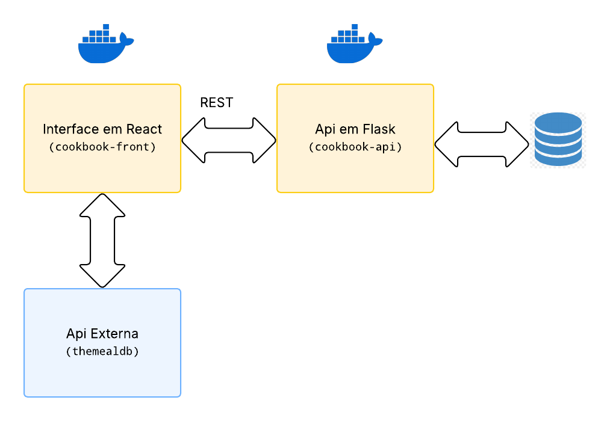

# Cookbook - Front-end

O **Cookbook** é o front-end de um projeto de receitas feito na pós-graduação. A ideia é ter um lugar para cadastrar, editar, ver e avaliar receitas de forma prática.

---

## 🚀 Instruções de instalação

Siga os passos abaixo para rodar o projeto localmente:

### 1. Pré-requisitos

Antes de tudo, certifique-se de que você tem instalado:

- [Node.js](https://nodejs.org/) (versão compatível: 19.2.0 ou superior)
- [NPM](https://www.npmjs.com/)
- [Git](https://git-scm.com/)
- (Opcional) [Docker](https://www.docker.com/) se quiser rodar o projeto em container

### 2. Clonar o repositório

```bash
git clone <URL_DO_REPOSITORIO>
cd <nome-do-repo>
```

### 3. Instalar dependências

```bash
npm install
```

### 4. Rodar o projeto localmente

```bash
npm start
```

O app vai estar disponível em: http://localhost:3000

---

### 🐳 Rodando com Docker (opcional)

Se preferir usar Docker:

```bash
sudo docker build -t cookbook-frontend .
sudo docker run -p 3000:3000 cookbook-frontend
```

**Certifique-se de que o backend esteja rodando em paralelo.**

---

## 🌐 API Externa Utilizada

Este projeto utiliza a API pública [TheMealDB](https://www.themealdb.com/) para obter informações como categorias e origens de receitas. Essa API é usada para facilitar o preenchimento de formulários e também para realizar buscas externas de receitas.

### 📄 Licença de Uso

- A TheMealDB é uma API gratuita para uso pessoal ou educacional.
- Não requer chave de API para endpoints públicos.
- Para uso comercial ou acesso premium, existe uma versão paga com mais recursos.

### 🔐 Cadastro

- Não é necessário realizar cadastro para usar os endpoints utilizados neste projeto.

### 🔗 Endpoints Utilizados

Os principais endpoints consumidos são:

- **Listar categorias**  
  `GET https://www.themealdb.com/api/json/v1/1/list.php?c=list`

- **Listar origens (áreas)**  
  `GET https://www.themealdb.com/api/json/v1/1/list.php?a=list`

- **Buscar receita por ID**  
  `GET https://www.themealdb.com/api/json/v1/1/lookup.php?i={idMeal}`

- **Buscar receita por nome**  
  `GET https://www.themealdb.com/api/json/v1/1/search.php?s={nome}`

## 🧭 Arquitetura da Aplicação


